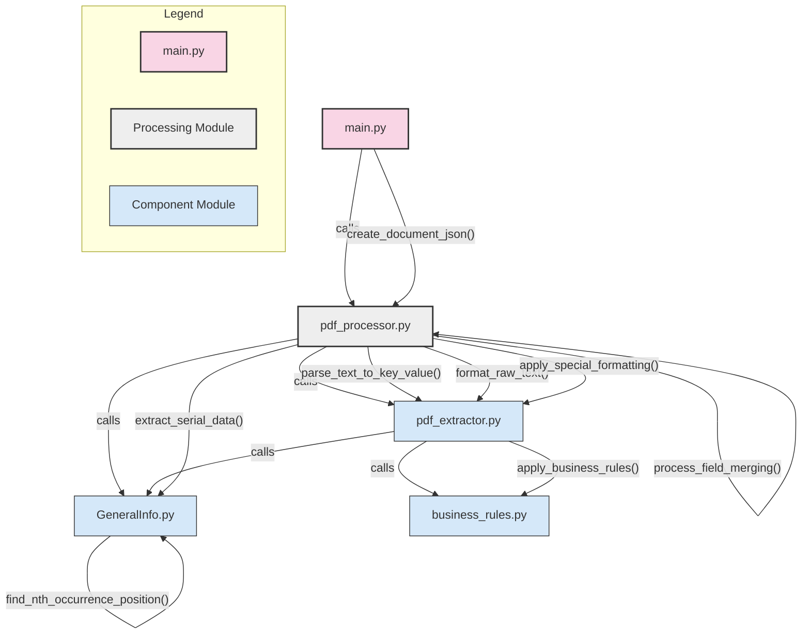

# PDF Extraction and Processing Documentation

## Section 1: Getting Started

### Installation and Setup

1. Ensure you have Python installed on your system (Python 3.6 or later recommended).

2. Install the required dependencies:
   ```bash
   pip install pdfplumber
   ```

3. Clone or download the repository containing the script files:
   - main.py
   - Components/pdf_processor.py
   - Components/pdf_extractor.py
   - Components/GeneralInfo.py
   - Components/business_rules.py

### Running the Script

To start using the PDF extraction script:

1. **Basic Usage:**
   ```bash
   python main.py
   ```

2. When prompted, enter the path to your PDF file:
   ```
   Enter the path to the PDF file: /path/to/your/file.pdf
   ```

3. The script will process the PDF and create a JSON file with the same name in the same directory as the PDF.

### Configuration

The extraction process is driven by the `extraction_params` list in `main.py`. Each dictionary in the list defines how to extract a specific section from the PDF:

```python
extraction_params = [
    {
        "field_name": "Report",                # Name for this extracted section
        "start_keyword": "Test Result:",       # Where to start extraction (Top based off keyword(s))
        "end_keyword": "Mock Result",          # Where to end extraction (Bottom based off keyword(s))
        "page_num": 0,                         # Page number (1st Page = 0, 2nd Page = 1 etc.)
        "horiz_margin": 300,                   # Horizontal width to capture (Set to be manual to cover deviations)
        "end_keyword_occurrence": 1,           # Which occurrence of end_keyword to use
        "forced_keywords": ["Mock Rasult"]     # Keywords to force as keys eg: Test Score 51 -> Test Score: 51
    },
    # Additional extraction parameter dictionaries...
]
```

## Section 2: Functional Rules

### PDF Extraction Logic

#### Bounding Box Creation

1. **Keyword Position Detection:**
   - The script locates the position of both `start_keyword` and `end_keyword` in the PDF.
   - For `end_keyword`, it can target a specific occurrence (e.g., 1st, 2nd, 3rd instance).

2. **Bounding Box Definition:**
   - Creates a rectangular box starting from the `start_keyword`
   - Width is determined by `horiz_margin` parameter
   - Height extends to the position of the specified occurrence of `end_keyword`

3. **Extraction Area:**
   ```
    <--Horizontal Margin Manually Set-->
   ┌─────────────────────────────────┐
   │ Start Keyword                   │
   │ Content to extract...           │
   │ ...                             │
   │ ...                             │
   │ End Keyword                     │
   └─────────────────────────────────┘
   ```

4. **Fallback Mechanisms:**
   - If a bounding box has negative dimensions, the script swaps coordinates (Usually for landscape pdfs)
   - If extraction fails, it attempts to extract using text-based approaches
   - Multiple fallback methods ensure robust extraction

### Text Parsing Rules

#### Key-Value Extraction

1. **Colon-Based Parsing:**
   - Text is parsed by identifying lines containing colons (`:`)
   - Format: `Key: Value`
   - Keys are text before the colon, values are text after the colon

2. **Multiple Key-Value Pairs:**
   - Handles multiple key-value pairs on the same line
   - Uses regex pattern: `([^:\s]+(?:\s+[^:\s]+)*):\s+(.*?)(?=\s+[^:\s]+:\s+|$)`
   - This captures keys, colons, and values in sequence

3. **Forced Keywords:**
   - `forced_keywords` parameter can turn specified terms into keys
   - If a keyword appears in text without a colon, adds a colon to make it a key
   - For example: Test Score 51 -> Test Score: 51

4. **Value Handling:**
   - Values can contain colons as long as they have no spaces in them (e.g., 12:34:56:78)
   - Empty values are skipped
   - Duplicate keys are handled by creating lists of values

5. **Merging Fields:**
   - Fields with `(+1)` suffix are merged with their base fields
   - Content is concatenated with proper separation markers
   - Duplicate keys between fields are intelligently merged

## Section 3: File Overview

### main.py
The entry point script that:
- Prompts for PDF file path
- Defines extraction parameters
- Calls the document processing functions
- Displays the resulting JSON content

### pdf_processor.py
The main processing module that:
- Orchestrates the extraction and parsing workflow
- Creates bounding boxes and extracts text
- Manages field merging for related sections
- Handles the creation of the final JSON structure
- Includes specialized functions for cleaning and post-processing data

### pdf_extractor.py
The extraction utility that:
- Handles formatting of raw text
- Implements the key-value parsing algorithm
- Applies business rules to extracted content
- Processes special keywords and forces them as keys when needed

### GeneralInfo.py
Core extraction functionality that:
- Implements the bounding box creation logic
- Finds keyword positions within PDF text
- Manages the extraction of text based on coordinates
- Provides fallback extraction methods for edge cases

### business_rules.py
Business logic module that:
- Applies domain-specific formatting rules
- Contains custom transformations for specific fields
- Allows extension for new business requirements
- Currently implements simple rules like removing specific keys

## Section 4: Adding Custom Business Rules

### Step 1: Update the business_rules.py File

Add your custom formatting functions for specific fields:

```python
def format_my_custom_field(data_dict):
    """
    Custom formatting function for "My Custom Field"
    
    Args:
        data_dict (dict): Dictionary of data to format
    """
    # Example: Combine first name and last name fields
    if "First name" in data_dict and "Last name" in data_dict:
        data_dict["Full name"] = f"{data_dict['First name']} {data_dict['Last name']}"
    
    # Example: Convert values to uppercase
    if "Code" in data_dict:
        data_dict["Code"] = data_dict["Code"].upper()
    
    # Example: Remove unwanted fields
    if "Internal ID" in data_dict:
        del data_dict["Internal ID"]
```

### Step 2: Register Your Function in apply_business_rules()

Update the `apply_business_rules` function to call your custom function:

```python
def apply_business_rules(field_name, data_dict, unparsed_lines):
    """
    Apply all business-specific rules based on the field name.
    
    Args:
        field_name (str): Name of the field
        data_dict (dict): Dictionary of parsed data
        unparsed_lines (list): Lines that couldn't be parsed with simple key-value rules
        
    Returns:
        dict: Dictionary with business rules applied
    """
    # Create a copy to avoid modifying the original
    result_dict = data_dict.copy()
    
    # Apply field-specific formatting rules
    if field_name == "Special Data":
        format_special_data(result_dict)
    elif field_name == "My Custom Field":
        format_my_custom_field(result_dict)
    # Add more field-specific rules here
    
    # Process unparsed lines if needed for this field
    if field_name == "Data With Tables" and unparsed_lines:
        process_table_data(result_dict, unparsed_lines)
    
    return result_dict
```

### Step 3: Processing Unparsed Lines

For complex data that doesn't fit the key-value pattern (like tables):

```python
def process_table_data(data_dict, unparsed_lines):
    """
    Process unparsed lines that might contain tabular data.
    
    Args:
        data_dict (dict): Dictionary to add processed data to
        unparsed_lines (list): Lines that couldn't be parsed with key-value pattern
    """
    if not unparsed_lines:
        return
        
    # Example: Parse a simple table
    table_data = []
    headers = None
    
    for line in unparsed_lines:
        # Skip empty lines
        if not line.strip():
            continue
            
        # Split by whitespace or another delimiter
        columns = line.split()
        
        # First non-empty line is the header
        if not headers:
            headers = columns
        else:
            # Create a row as a dictionary
            if len(columns) == len(headers):
                row = {headers[i]: columns[i] for i in range(len(headers))}
                table_data.append(row)
    
    # Add the table data to the result dictionary
    if table_data:
        data_dict["Table"] = table_data
```

### Step 4: Update extraction_params in main.py

Add your new field to the extraction parameters:

```python
extraction_params.append({
    "field_name": "My Custom Field",
    "start_keyword": "Custom Section:",
    "end_keyword": "Next Section",
    "page_num": 2,
    "horiz_margin": 200,
    "end_keyword_occurrence": 1,
    "forced_keywords": ["Important Note", "Reference Code"]
})
```

### Best Practices for Business Rules

1. **Modular Design:** Create separate functions for each field or rule type.
2. **Defensive Programming:** Always check if keys exist before operating on them.
3. **Documentation:** Add detailed docstrings to explain the purpose of each rule.
4. **Testing:** Test rules with sample data before applying to production PDFs.
5. **Consistency:** Maintain a consistent approach to how you transform data.

## Section 5: System Architecture



### Flow Description

1. **User Interaction**:
   - User runs `main.py` and provides the PDF file path
   - `main.py` defines extraction parameters and calls `create_document_json()`

2. **Document Processing**:
   - `pdf_processor.py` orchestrates the extraction workflow
   - It calls `extract_pdf_data()` for each parameter set
   - Results are merged and formatted into a JSON structure

3. **Text Extraction**:
   - `GeneralInfo.py` handles the core PDF text extraction
   - It locates keywords and creates bounding boxes
   - It extracts text based on the defined coordinates

4. **Data Parsing**:
   - `pdf_extractor.py` formats the raw text
   - It parses the text into key-value pairs
   - It applies special formatting based on field names

5. **Business Rules**:
   - `business_rules.py` applies domain-specific transformations
   - It formats special fields and handles unparsed lines
   - It can be extended for custom business requirements